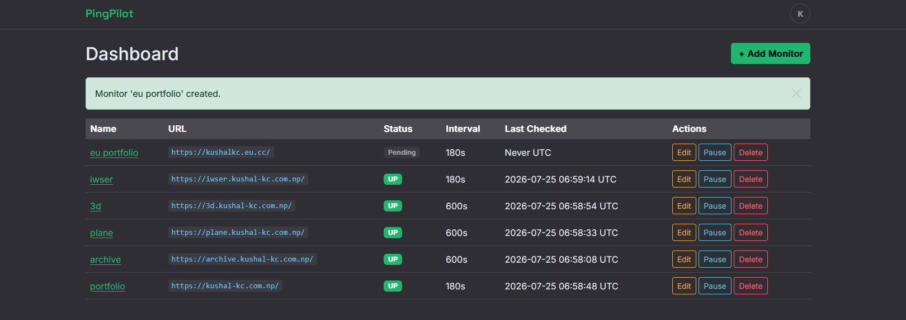
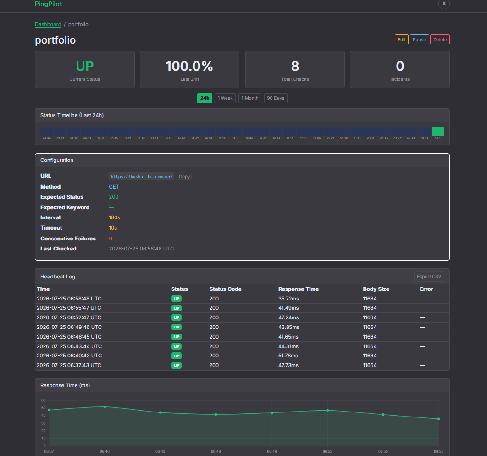
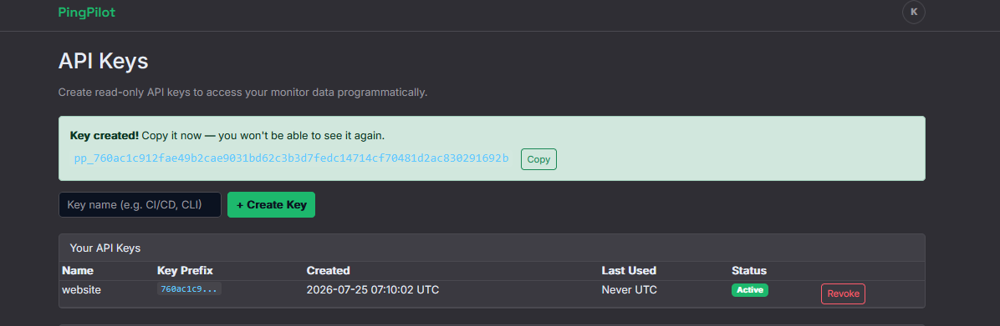

# PingPilot

  

  <a href="https://ping.kushal-kc.com.np"><strong>ping.kushal-kc.com.np</strong></a>

Uptime monitoring for your websites and APIs.

website:  <a href="https://ping.kushal-kc.com.np"><strong>ping.kushal-kc.com.np</strong></a>
- Monitor uptime with configurable intervals
- Incident tracking
- email alerts (down & recovery)

  
   Dashboard

  
   Monitor Detail

  
   API Keys

## API

Read-only API authenticated via `X-API-Key` header. Manage keys at `/dashboard/api-keys/`.

| Endpoint | Description |
|---|---|
| `GET /api/monitors/` | List all monitors |
| `GET /api/monitors/<id>/` | Monitor details |
| `GET /api/monitors/<id>/heartbeats/?days=N` | Heartbeat log |
| `GET /api/monitors/<id>/incidents/` | Incidents |
| `GET /api/monitors/<id>/stats/` | Uptime stats |

